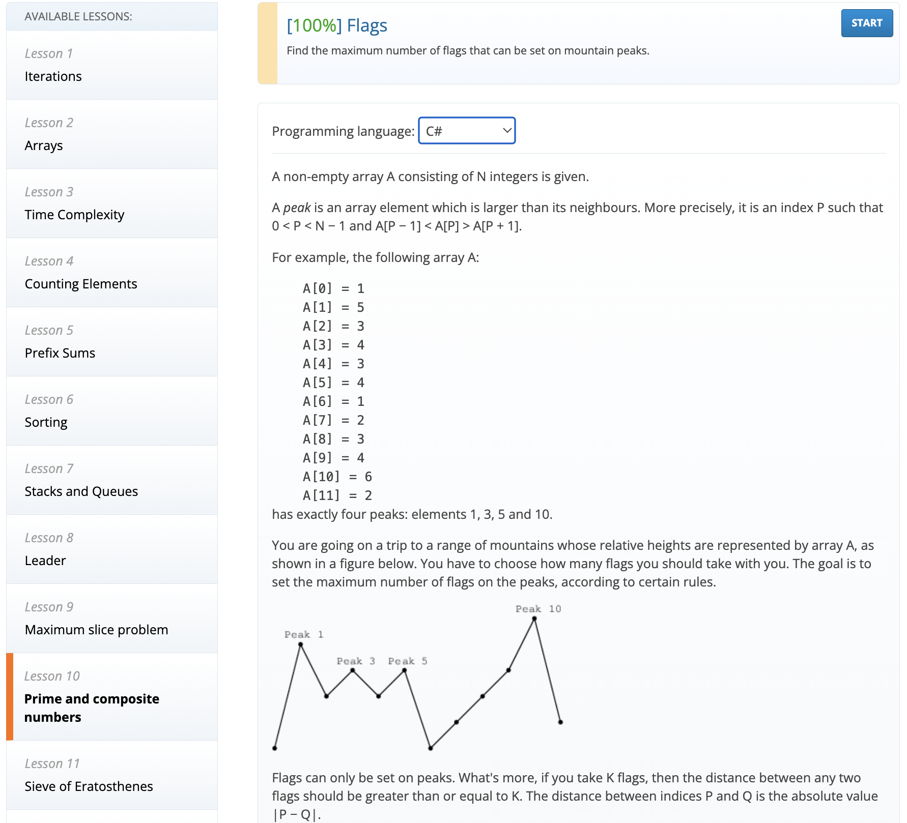

## 🚀 ¡Bienvenidos al video donde exploramos TDD paso a paso! 🚀

> En este video, vamos a sumergirnos en el mundo del desarrollo impulsado por pruebas (TDD) mientras resolvemos el ejercicio 10 de Codility, usando C#. Desde la configuración del proyecto hasta la implementación final, te llevaré por cada paso del proceso, aplicando las tres leyes de TDD y explicando cómo convertir el código de rojo a verde con estrategias efectivas.

> Este repositorio encontrarás la solución del ejercicio 10 de Codelity usando C# con una calificación del 100%

> Find the maximum number of flags that can be set on mountain peaks

## Link

https://app.codility.com/programmers/lessons/10-prime_and_composite_numbers/flags/ 
